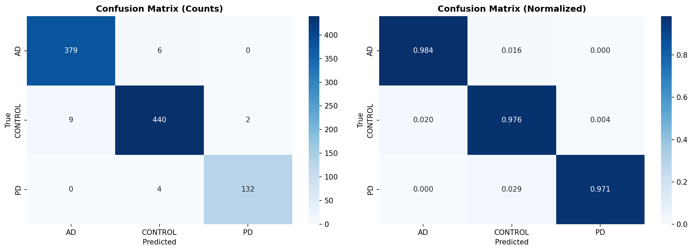
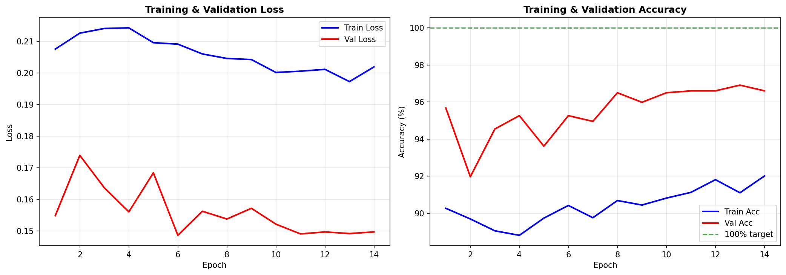
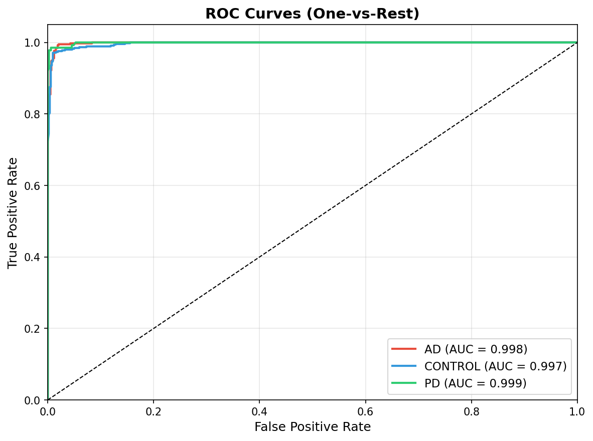

# 🧠 NeuroFuseNet – Brain MRI Disease Classifier

🚀 A hybrid AI architecture for medical image classification combining CNN + Transformer fusion.

A deep learning-based system for classifying brain MRI scans into:

* Alzheimer’s Disease
* Parkinson’s Disease
* Healthy Control

🚀 Achieved **98.46% test accuracy** using advanced deep learning techniques.

---

## 🔍 Overview

**NeuroFuseNet** is a hybrid deep learning framework that combines **EfficientNetV2** and **Swin Transformer** using **cross-attention fusion** to accurately classify neurological conditions from MRI scans.

It also integrates **Grad-CAM explainability** to highlight important brain regions influencing predictions.

---

## 🧠 Model Architecture

* EfficientNetV2 (Local feature extraction)
* Swin Transformer (Global context learning)
* Cross-Attention Fusion Module
* Focal Loss + Label Smoothing
* OneCycle Learning Rate Scheduler
* Test-Time Augmentation (TTA)

---

## 🚀 Features

* Hybrid Deep Learning Model (CNN + Transformer)
* Cross-Attention based feature fusion
* Grad-CAM++ for explainability
* Test-Time Augmentation (TTA)
* High-performance classification with strong generalization

---

## 📊 Model Performance

* ✅ **Test Accuracy (TTA):** 97.84%
* ✅ **Macro AUC-ROC:** 0.9981
* ✅ **F1 Score:** ~0.98 across all classes

---

## 📸 Results

### 🔹 Confusion Matrix



### 🔹 Training Curves



### 🔹 ROC Curve



---

## 🛠 Tech Stack

* Python
* PyTorch
* OpenCV
* NumPy
* Matplotlib
* Scikit-learn
* timm

---

## 📂 Project Structure

```
NeuroFuseNet/
│
├── notebook/
│   └── NIRJALA_13.ipynb
│
├── outputs/
│   ├── confusion_matrix.png
│   ├── training_curves.png
│   ├── roc_curves.png
│   ├── gradcam_visualizations.png
│   ├── sample_images.png
│   └── results_summary.json
│
├── model/
│   └── (model available via Google Drive)
│
├── README.md
├── requirements.txt
```

---

## ▶️ How to Run

### 1. Clone the repository

```bash
git clone https://github.com/Jarpula-Nirjala/NeuroFuseNet.git
cd NeuroFuseNet
```

### 2. Install dependencies

```bash
pip install -r requirements.txt
```

### 3. Run the notebook

Open:

```
notebook/NIRJALA_13.ipynb
```

---

## ⚠️ Dataset

Due to size limitations, the dataset is not included.

👉 **Download Dataset:**
https://drive.google.com/file/d/1AnHbNwv5rBtxYwCBDUwXS_dIGAs2FX1F/view?usp=sharing

---

## 📥 Model Download

Due to GitHub file size limitations (~195MB), the trained model is hosted on Google Drive:

👉 **Download Trained Model:**
https://drive.google.com/file/d/1rDF-vTOgMSIrpE3rV1OXukyhXiVNxxRq/view?usp=sharing

---

## 📌 Future Improvements

* Deploy as a web application (Streamlit / Flask)
* Add real-time MRI prediction interface
* Expand dataset for better generalization
* Optimize model for faster inference

---

## ✨ Author

**Jarpula Nirjala**
📧 [nirjala8462@gmail.com](mailto:nirjala8462@gmail.com)
🔗 https://www.linkedin.com/in/nirjala-jarpula-749346321/

---

## ⭐ Support

If you like this project, give it a ⭐ on GitHub!
